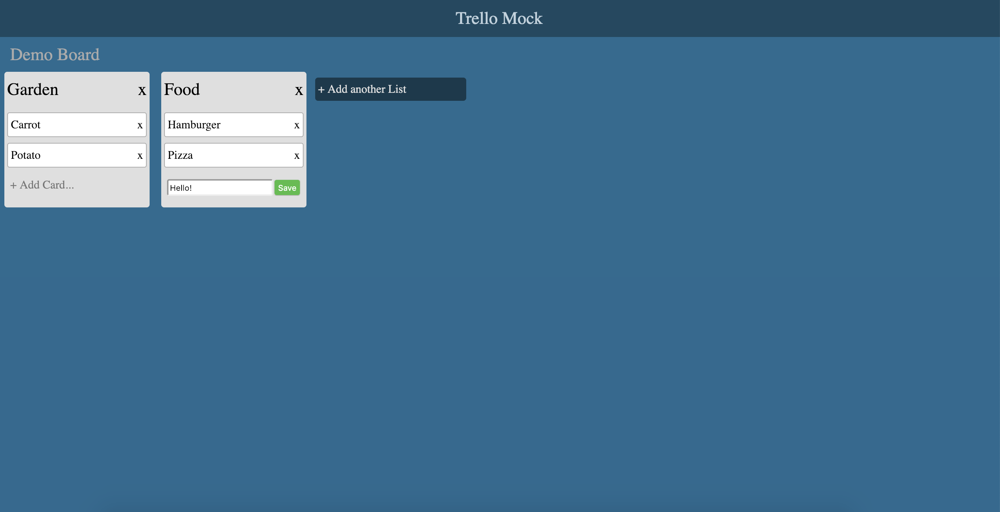

# Trello Mock

This repository is a simple Trello Mock. You can also [click here to see the demo](https://m1771vw.github.io/trello-mock/).  

## Table of Contents

- [Getting Started](#getting-started)
- [Prerequisites](#prerequisites)
- [Downloading The Project](#downloading-the-project)
- [Setting Up The Front End](#setting-up-the-front-end)
- [Running The Project](#running-the-project)
- [Built With](#built-with)


## Getting Started

These instructions will get you a copy of the project up and running on your local machine for development and testing purposes. 

### Prerequisites

In order to run this project, you need to have [Node.js](https://nodejs.org/en/) installed. To tell if you have it installed, open your Command Line/Terminal and type the following:

```
$ node -v
v10.x.x
```

### Downloading The Project

To begin setting up the project, either download the project by clicking [here](https://github.com/m1771vw/trello-mock.git) or by cloning the project: 

```
$ git clone https://github.com/m1771vw/trello-mock
$ cd trello-mock
```

### Setting Up The Front End

Navigate to the root of the project folder and run `npm install`:
```
$ npm install
```
After the dependencies have been installed, you can start the project.

### Running The Project

To run the project, you will need to be in the `trello-mock` directory. 

Run `npm start`.

To confirm the frontend has started, you should see this screen.

<p align="center">
  
</p>

## Built With

* [React.js](https://reactjs.org/) 
